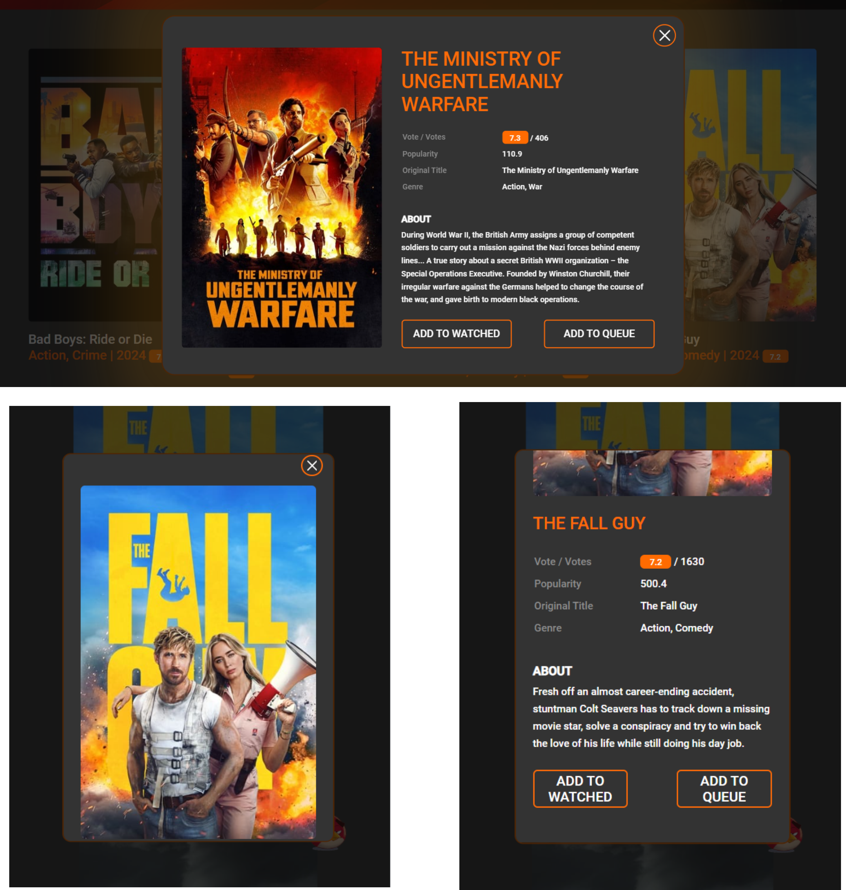

# Movies-App

## Project Description

Movies-App is a group project that underwent significant changes after its completion. I completely
overhauled the project, fixing bugs and improving the styling. The application is responsive and
optimized for different screen sizes, including desktop (1280p), tablet (768p), and mobile devices
(450p).

## Features

- **Main Page (Header)**: Contains basic information and navigation.
- **My Library Page**: Displays movies added to the bookmarks.
- **Modal Window**: Shows movie details, its cover, and two buttons:
  - **Add to Watches Bookmark**: Adds the movie to the "watches" bookmark.
  - **Add to Queue Bookmark**: Adds the movie to the "queue" bookmark.
- Movies added to bookmarks are visible on the "My Library" page.

## Technologies

- **Parcel** - A fast bundler for web applications.
- **Sass** - A CSS preprocessor.
- **Axios** - A library for making HTTP requests.
- **Siema** - A lightweight library for creating carousels.
- **TUI Pagination** - A library for pagination

## Installation

1. Clone the repository:

   ```bash
   git clone https://github.com/LukaszMarchlinski/Movies-App.git

   ```

2. Install dependencies:

```bash
npm ci
```

3. Run the application in development mode:

```bash
npm run dev
```

```bash
web- http://localhost:1234
```

## Scope of functionality

1. Header responsive

,

- dark mode

,

2. Header library

,

3. Modal movie responsive

,

- sark mode ,

4. Scroll up

,

5. Team footer

,

## Contact

GitHub: LukaszMarchlinski
